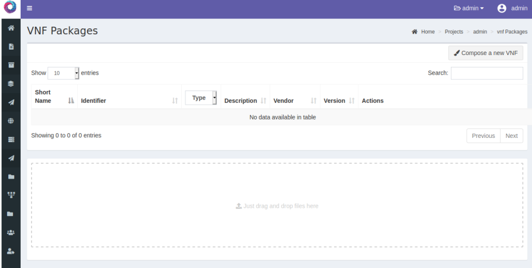

# K8s as a Service

## Présentation

L’objectif de ce projet est de permettre à un opérateur télécom exploitant un réseau
5G, de créer dynamiquement une infrastructure cloud-native (K8s cluster) sur une
infrastructure de virtualisation de machines (Openstack) afin de déployer des fonctions
réseau virtualisées (VNF) à base de container. Le modèle d’information ETSI NFV est utilisé
pour abstraire les services réseaux.

La plateforme expérimentale réalisée est définie par un empilement de produits open
source dont le socle est constitué par Openstack qui sert d’hyperviseur. La gestion des VNF
est effectuée par l’orchestrateur de référence de l’ETSI, Open-Source MANO. L’originalité de
ce projet consiste à articuler aux deux briques précédentes, l’orchestrateur de conteneurs
Kubernetes, qui permet d’introduire la virtualisation légère.

Pour plus de détails sur ce projet lire le rapport se trouvant dans ce répertoire.

## Images

